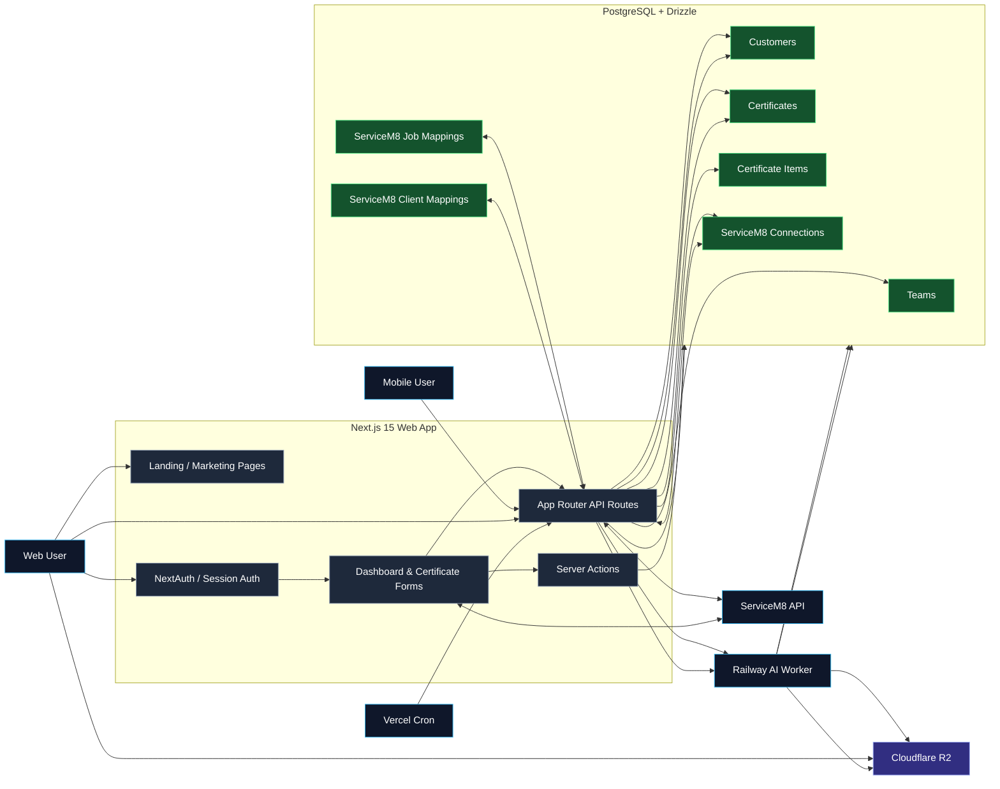

# Project Dataflow Diagram

This diagram shows the main runtime flows in AI Certify: web and mobile requests, authentication, database access, ServiceM8 integration, AI worker calls, and scheduled backup handling.

## Reading the diagram

- **Web users** interact with the landing pages, authenticate with NextAuth, and use the dashboard and certificate forms.
- **Server actions and API routes** handle most app logic and persist data via PostgreSQL/Drizzle.
- **ServiceM8** connects through OAuth and is used for jobs, clients, and connection management.
- **Mobile users** hit the mobile API routes, which reuse the same database and ServiceM8 connection layer.
- **The Railway worker** handles AI-assisted analysis and the database backup job.
- **Cloudflare R2** stores uploaded files and generated backup archives.
- **Vercel Cron** triggers the scheduled backup route, which forwards the job to Railway.
